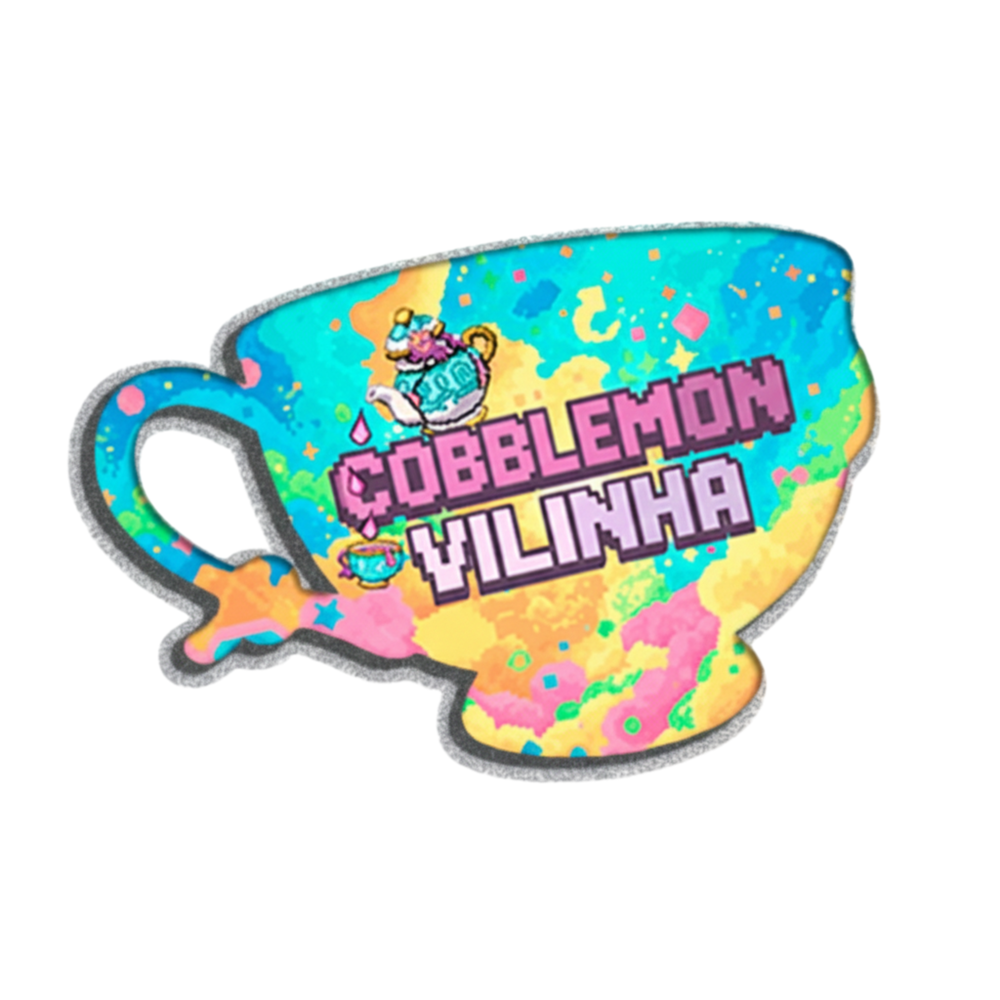

<h1 align="center">Cobblemon Vilinha</h1>

<em><h5 align="center">(Cobblemon Vilinha Launcher)</h5></em>

Launcher do Servidor de Minecraft Cobblemon Vilinha

## Atualizações

- 🎨 Visual & Interface (UI/UX)
Novo Tema "Vilinha":

Implementação da paleta de cores personalizada com destaque para o Rosa Neon e tons escuros para maior conforto visual.

Efeito de Glassmorphism (Vidro Fosco) adicionado aos painéis de Login e Status Lateral.

Botões de ação (Jogar/Login) agora possuem gradientes animados e efeitos de pulsação.

Logo Centralizada 3D:

Adicionada a nova logo oficial "Cobblemon Yilinha" em alta resolução.

A logo agora flutua no centro da tela com animação suave, sobrepondo o cenário de fundo.

Perfil de Usuário:

O Avatar e o Nickname foram movidos para o canto superior esquerdo para melhor organização.

Remoção: A opção de "Editar Avatar" direto pelo launcher foi removida para garantir maior estabilidade e evitar edições acidentais. O avatar agora é apenas visualização.

- 🧹 Limpeza de Layout
Minimalismo:

Remoção da barra de ícones de redes sociais (YouTube, Instagram, etc.) para um visual menos poluído.

Ocultação do botão de "Notícias" antigo que não estava sendo utilizado.

Status do Servidor:

O contador de jogadores e status da Mojang/Microsoft foram reposicionados abaixo da logo central, com novas cores de destaque (Verde para Online).

Ajuste de camadas (z-index) para garantir que as informações de status fiquem sempre visíveis e legíveis sobre a logo.

- 🔧 Ajustes Técnicos
CSS Refatorado:

O código de estilo (launcher.css) foi otimizado.

Implementação de posicionamento fixed para elementos centrais, garantindo compatibilidade com diferentes resoluções de monitor.

Correção do bloqueio de visualização na área central (#center) que antes impedia a exibição de imagens.
